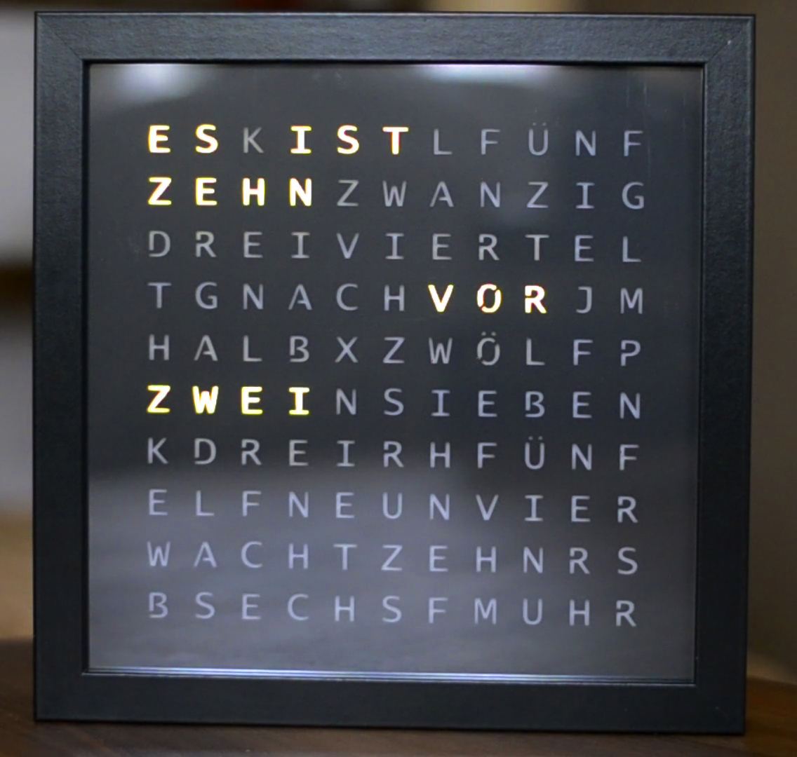
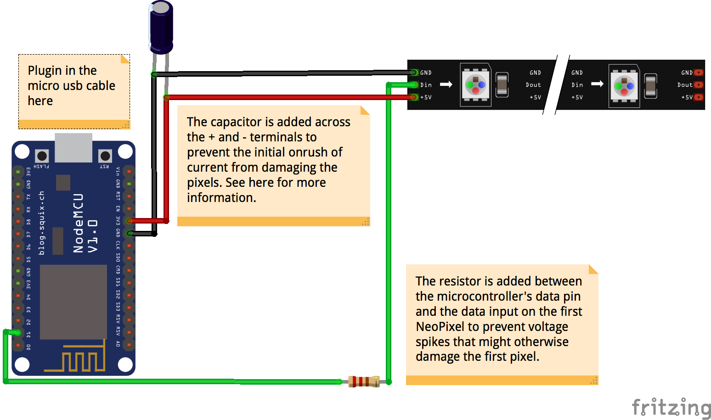

# Word Clock

Code for a simple DIY-version of the famous Word Clock based on a NodeMCU ESP8266 development board and Adafruit NeoPixels LED strip.
 
 

### Components
- [NodeMCU ESP8266](https://www.amazon.de/gp/product/B074Q2WM1Y/ref=oh_aui_detailpage_o04_s00?ie=UTF8&psc=1)
- [Adafruit NeoPixels LED strip](https://www.adafruit.com/product/1138)
- [300 Ohm resistor](https://www.amazon.de/gp/product/B009XOP5WM/ref=oh_aui_detailpage_o08_s00?ie=UTF8&psc=1)
- [1000uF 35V electrolytic capacitor](https://www.amazon.de/gp/product/B00ZBU6D5K/ref=oh_aui_detailpage_o07_s00?ie=UTF8&psc=1)
- [25 x 25 picture frame](https://www.amazon.de/IKEA-RIBBA-Rahmen-schwarz-23x23x4/dp/B00KGBMB6O/ref=pd_sim_201_1?_encoding=UTF8&psc=1&refRID=A74KY0ZYZ64R8BQ1XT98)
- [23 x 23 frosted acrylic glass](https://expresszuschnitt.de/PLEXIGLAS-weiss-milchglas)
- [23 x 23 adhesive film with plotted letters](https://github.com/TobiasBuchholz/WordClock/blob/master/design/letters_front.pdf)
- micro USB cable + power supply

### Breadboard:

See [Adafruit guide](https://learn.adafruit.com/adafruit-neopixel-uberguide/powering-neopixels) for more information.

### NodeMCU code
The NodeMCU is the brain of the clock and is written in the Arduino environment. 
It connects to the local wifi via SSID and password and sets up a web sockets server to enable a real time connection between a client app and itself. After the connection is established it is possible to adjust the color and brightness of the LED strip. When the connection is closed the NodeMCU stores the adjusted values into its EPROM and retrieves them from now on after every boot. 
To display the time the NodeMCU queries the current time in an interval of 10 seconds from a NTP server, transforms it into a human readable sentence and enlightens the corresponding LEDs.

The following libraries are beeing used:
- ESP8266Wifi: https://github.com/esp8266/Arduino
- WebSocketsServer: https://github.com/Links2004/arduinoWebSockets
- Adafruit NeoPixels: https://github.com/adafruit/Adafruit_NeoPixel

### Android & iOS client
The clients provide the possibility to connect to the clock via the local wifi. After the connection is established it is possible to adjust the color and brightness of the LED strip in real time. There is also a Nightmode which decreases the brightness of the LEDs according to the configured value and time to save some energy. The clients are build with the crossplatform solution provided by [Xamarin](https://developer.xamarin.com/).

The following libraries are beeing used:
- ReactiveUI: https://github.com/reactiveui/ReactiveUI
- ReactiveUI.Fody: https://github.com/kswoll/ReactiveUI.Fody
- WebSockets.PCL: https://github.com/NVentimiglia/Websockets.PCL
- Akavache: https://github.com/akavache/Akavache

### Demo

[Youtube](https://www.youtube.com/watch?v=xTer7YWEIt0)
